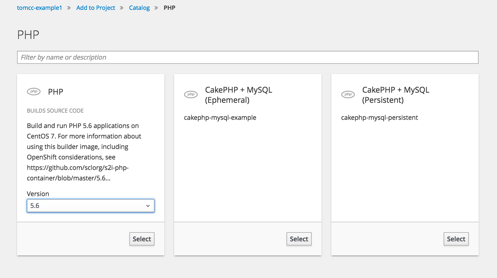

# Lab 3: Getting Started on the Lab Platform

In this lab, we will be interacting with the Lab platform for the first time, via the oc client as well as via the web console

## Login

**Note:** 
Make sure you have successfully completed [Lab 2](02_cli.md).

Please use the information provided by the instructor for the login on the web interface as well as with `oc`.

## Create a project

A project in OpenShift is the top level concept to organize your applications, deployments, builds, containers, etc. See [Lab1](01_quicktour.md).

## Task: LAB3.1
Create a new project on the lab platform with the oc CLI tool.

**Note**: For your project name, use your github name or your last name, for example `[USER]-example1`

> How can I create a new project?

**Tip**: the oc tool has a built-in help function:

``oc help``

## Web Console

The OpenShift V3 Web Console allows users to perform certain tasks directly via a browser.

## Task: LAB3.2
1. Log on to the Lab platform using the Web Console.

  **Note:** The **URL**, user name and password for your account will be provided to you by Techlab by the Instructor.

1. Now go to the overview of your newly created project. Currently the project is still empty.

1. Add your first application to your project using *Add to Project*. As an example project, we use an Agello Example.

  3.1. Select the base image **php** and select **5.6** from the dropdown menu
  

  3.2. Give your example a recognisable name and the following URL as Repo URL
  
  ``https://github.com/agello/example-php-sti-helloworld.git``
  

1. The application has been created. The link **Continue to overview** gives you an overview.

1. The build of your application is started. Follow the build and look at the sample app after deployment.

You have now deployed your first application using the so-called **[Source to Image]** build on OpenShift deployed .

**Tip:** Use the following command to switch to another project:

``oc project [projectname]``

**Tip:** The following commands can be used to create the above example from the command line:

``
oc new-app https://github.com/agello/example-php-sti-helloworld.git --name=agello-php-sti-example
oc expose svc appuio-php-sti-example
``

**Tip:** a whole app can be deleted with the following command:

``oc delete all -l app=appname``

For example,

``oc delete all -l app=appuio-php-sti-example``

---

## Solution: LAB3.1

``oc new-project [USER]-example1``

---

**End Lab 3**

 <a href="04_deploy_dockerimage.md"> Deploying a Docker Image → </a> 

[← back to overview](../README.md)
